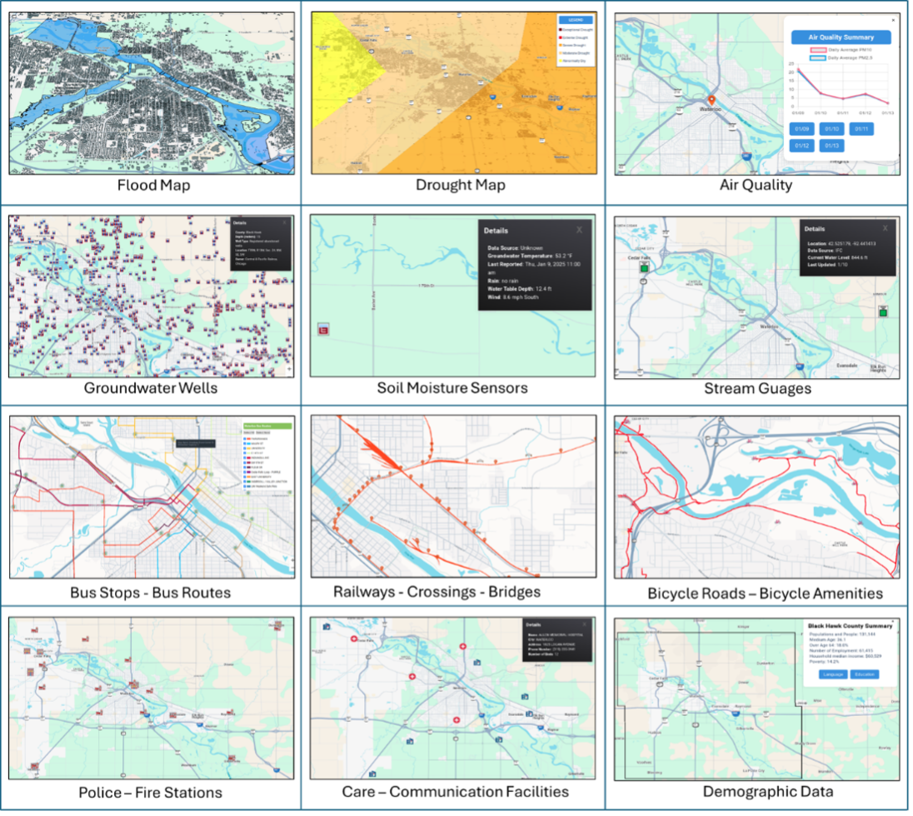

# City-Scale Digital Twin Framework

## Table of Contents

* [Introduction](https://github.com/uihilab/CityDigitalTwin#Introduction)
* [Feedback](https://github.com/uihilab/CityDigitalTwin#Feedback)
* [License](https://github.com/uihilab/CityDigitalTwin#License)
* [Acknowledgements](https://github.com/uihilab/CityDigitalTwin#Acknowledgements)
* [References](#references)

## Introduction
Urban areas are increasingly vulnerable to flooding due to climate change and rapid urbanization. Traditional mapping and decision-support tools lack the capability to integrate real-time data or analyze cascading disruptions across interconnected urban systems. Digital twins offer a promising solution by enabling real-time monitoring, simulation, and optimization of urban environments.

This project presents a comprehensive, city-scale digital twin framework that integrates flood forecasting, transportation networks, and critical infrastructure systems into a unified, real-time cyberinfrastructure. By leveraging data from sensors, hydrological models, and geographic information systems (GIS), the framework provides a dynamic and interactive platform for city planners and emergency managers to visualize, analyze, and proactively manage urban flood events and their cascading impacts.

## Feedback
We welcome your feedback! If you encounter any issues or have suggestions for improvement, please feel free to file an issue in the project's GitHub repository.

## License
This project is licensed under the MIT License - see the [LICENSE](https://github.com/uihilab/CityDigitalTwin/blob/master/LICENSE) file for details.

## Acknowledgements
This framework was developed through a collaborative effort by researchers from several institutions:

* IIHR—Hydroscience and Engineering, University of Iowa, Iowa City, IA, USA - [Link](https://hydroinformatics.uiowa.edu/)
* Department of Computer Engineering, Sakarya University, Sakarya, Türkiye - [Link](https://cs.sakarya.edu.tr/)
* Department of Information Systems Engineering, Sakarya University, Sakarya, Türkiye - [Link](https://bsm.sakarya.edu.tr/)
* Department of River-Coastal Science and Engineering, Tulane University, New Orleans, LA, USA - [Link](https://sse.tulane.edu/river)
* ByWater Institute, Tulane University, New Orleans, LA, USA - [Link](https://bywater.tulane.edu/)

This project has received funding from the European Union’s Horizon Europe Research and Innovation Programme under grant agreement 101070125.

## References

* Kaynak, S., Kaynak, B., Mermer, O., & Demir, I. (2025). City-scale digital twin framework for flood impact analysis: Integrating urban infrastructure and real-time data analytics. *EarthArXiv*. [doi:10.31223/X53F0T](https://doi.org/10.31223/X53F0T)
